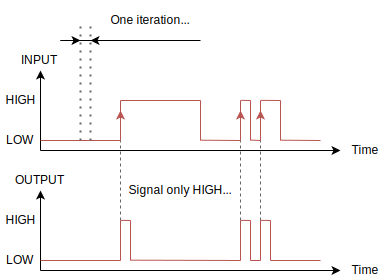

<p align="center">
    
</p>

---------------------------------------------------------------------------------------------------------

A small helper library with components and sturctures frequently used in low level programming, especially with the arduino framework. Feel free to use the whole library or just copy single header files to use in your ardunio and co. projects. The code is not something game-breaking just snippets and stuff I frequently use, nicely packed together, documented and explained as best as I could.


## Contents

The following topics provide some information and explaination about the contents of this library, including examples on how and when to use them!


### 1. Timing

Everything related to changing signals in a time based matter.

### 1.1. `TOff` - Timer for extending signals

A `TOff` timer class helps extending a signal for a set duration, here called the `phase`. It is also very handy to unite many smaller signals into one large signal, more on that in [this code tutorial](#1-clean-handling-of-an-input-button-with-serial-output). Here is an input signal and the output signal of a `TOff` timer graphed over time:

<p align="center">
    
<p>

The timer takes only one argument to initialize, the `phase`. To get the output signal for a given input signal, use the `exec()` function:

```cpp
# include "timing/toff.hpp"

// Create new TOff timer with 1000ms phase
static TOff timer (1000);

void loop() {
    bool input = digitalRead(8);        // Example reading of input on PIN 8
    bool output = timer.exec(input);
}
```

### 1.2. `TOn` - Timer for delaying signals

A `TOn` timer class helps delaying a signal for a set duration, here called the `phase`. It helps removing smaller disturbances in signals or can function as a kind of confirmation, that the user really wants a certain action to happen.  ere an input signal and the output signal of a `TOn` timer graphed over time:

<p align="center">
    
</p>

The timer takes only one argument to initialize, the `phase`. To get the output signal for a given input signal, use the `exec()` function:

```cpp
# include <timing/ton.hpp>

// Create new TOn timer with 1000ms phase
static TOn timer (1000);

void loop() {
    bool input = digitalread(8);        // Example reading of input on PIN 8
    bool output = timer.exec(input);
}
```

---------------------------------------------------------------------------------------------------------

### 2. Triggers

Triggers help processing signals at the right time, pace or in the right context.

### 2.1. `RTrig` - Rising Trigger

A rising trigger activates only for a single iteration when a signal has changed from `LOW` to `HIGH`. Which can be very useful when only wanting code to execute once, even if the signal is `HIGH` (or `true`) for multiple iterations of the `loop`. (More on that in [this example](#1-clean-handling-of-an-input-button-with-serial-output))

Here is the input signal with the resulting output signal of an `RTrig` graphed:

<p align="center">
    
</p>

Using the trigger is simple, just initialize it, no arguments required!

```cpp
# include "triggers/rtrig.hpp"

static RTrig trigger;

void loop() {
    bool input = digitalRead(8);        // Example reading of input on PIN 8
    bool output = trigger.exec(input);
}
```

### 2.2. `FTrig` - Falling Trigger

A falling trigger activates only for a single iteration when a signal has changed from `HIGH` to `LOW`. Which can be very useful when only wanting code to execute once for e.g. a kind of `onrelease()`-event of a button.

Here is the input signal with the resulting output signal of an `FTrig` graphed:

<p align="center">
    
</p>

Using the trigger is simple, just initialize it, no arguments required!

```cpp
# include "triggers/ftrig.hpp"

static FTrig trigger;

void loop() {
    bool input = digitalRead(8);        // Example reading of input on PIN 8
    bool output = trigger.exec(input);
}
```

## Code examples & tutorials

### 1. Clean handling of an input button with serial output

Given that we have a small button at pin `8` and we want to print out a message each time we press our button, we might start with a code that looks like the following:

```cpp
# define SWITCH_PIN 8

void setup() {
    // Set up our serial interface
    Serial.begin(9600);

    // Set up our input switch
    pinMode(SWITCH_PIN, INPUT);
}

void loop() {
    if (digitalRead(SWITCH_PIN)) {
        // Print the event message to our serial monitor
        Serial.println("Button pressed!");
    }
}
```

If we press our button **once**, even if we only tap it, we will get something like this in our serial monitor:

```
Button pressed!
Button pressed!
Button pressed!
Button pressed!
Button pressed!
```

and when we hold the button, the microcontroller keeps printing our success message. Which is great, but what if we want to, just as an example, send a message over network to a server or do other stuff that we only want to do once? 

For this case, we use a *rising trigger* or short `RTrig`! It allows us to only fire an event once, right when the signal changes to `HIGH`. Or in other words, right when we start to press the button. (See the full explaination of the `RTrig` [here](#21-rtrig---rising-trigger))

Using such a trigger is simple, we just have to import, initialize and use it like in the following snippet:

```cpp
# include <triggers/rtrig.hpp>

# define SWITCH_PIN 8

// We initialize our trigger here
static RTrig trigger;

void setup() {
    // Set up our serial interface
    Serial.begin(9600);

    // Set up our input switch
    pinMode(SWITCH_PIN, INPUT);
}

void loop() {
    // Process the input signal through the trigger
    if (trigger.exec(digitalRead(SWITCH_PIN))) {
        // Print the event message to our serial monitor
        Serial.println("Button pressed!");
    }
}
```

Now it does not matter anymore if we tap or hold the button, the `if`-statement will only be executed once. However there can still be some issues:

1. **Our user is very angry and presses the button at a very high speed, which we do not like**  
    As mentioned before you might have the case that you bind something like sending a message over network or similar to this button. Such processes can be very intense in terms of calculation power so you do not want to handle a lot of them in a short period of time.
2. **Our button does not give a clean signal**
   Sometimes when pressing a button, an incomplete closing, a kind of bouncing of the two metal connectors can occur, which causes the button to close and open rapidly a few times b. While not being dramatic in a larger time scale our microcontroller is fast enough to detect each of these connections and disconnections as signals, causing multiple events, even with the `RTrig` implemented.

This issue however can easily be fixed by using a `TOff`-timer component, as it merges mutliple signals that come in too fast into one, which we can then extract a single signal of using the already mentioned `RTrig`. The processing of the signal is graphed below: 

<p align="center">
    
</p>

```cpp 
# include "timing/toff.hpp"
# include "triggers/rtrig.hpp"

# define SWITCH_PIN 8

// We initialize our trigger here
static RTrig trigger;
// And the timer here, forcing a minimum time between inputs of 200ms
static TOff timer;

void setup() {
    // Set up our serial interface
    Serial.begin(9600);

    // Set up our input switch
    pinMode(SWITCH_PIN, INPUT);
}

void loop() {
    // Process the input signal through the timer, then the trigger
    if (trigger.exec(timer.exec(digitalRead(SWITCH_PIN)))) {
        // Print the event message to our serial monitor
        Serial.println("Button pressed!");
    }
}
```